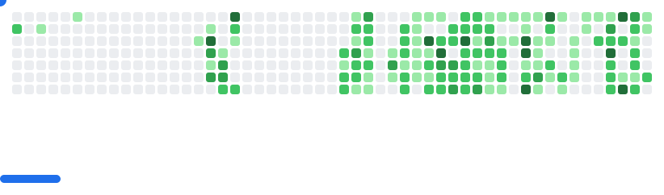

## Hey there, I'm Akhil 👨‍💻

> Full-time Debugger | Part-time Philosopher

---

### What I work with
`TypeScript` `Node.js` `PostgreSQL` `MongoDB` `Docker` `React` `Next.JS` `AWS` `GCP`

### What I'm learning
`System Design` `Event-driven Architecture` `Cryptography`

### When I'm not coding
Chess • Psychology books • Existential debates • Weightlifting • Manga/Manhwa

### 📫 Find me

  
  
  
  
  

---
<picture>
  <source
    media="(prefers-color-scheme: dark)"
    srcset="images/breakout-dark.svg"
  />
  <source
    media="(prefers-color-scheme: light)"
    srcset="images/breakout-light.svg"
  />
  
</picture>
